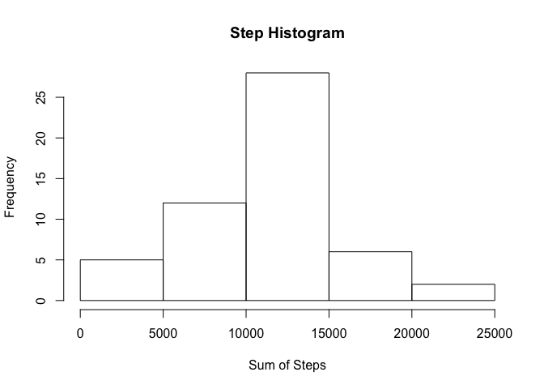
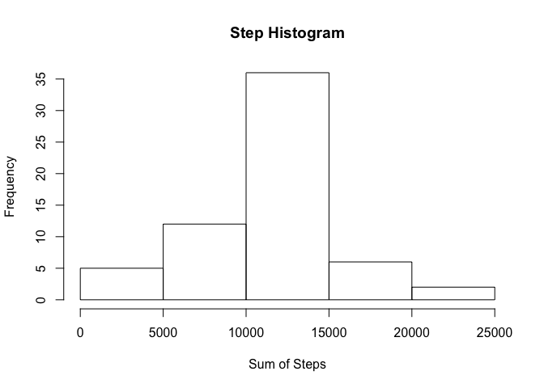
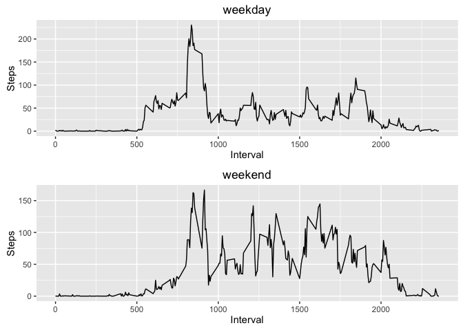

# Reproducible Research: Peer Assessment 1


```
## Warning: package 'ggplot2' was built under R version 3.2.3
```

## Loading and preprocessing the data


```r
data <- read.csv("activity.csv")
```

##What is mean total number of steps taken per day?

1 - Calculate the total number of steps taken per day


```r
data_daily <- aggregate(x = data[c("steps")],
                                   FUN = sum,
                                   by = list(Group.date = data$date))
```

2 - Make a histogram of the total number of steps taken each day


```r
hist(data_daily$steps, xlab = "Sum of Steps", main = "Step Histogram")
```



3 - Calculate and report the mean and median of the total number of steps taken per day


```r
cat("Mean daily steps: ", mean(data_daily$steps, na.rm = TRUE))
```

```
## Mean daily steps:  10766.19
```

```r
cat("\nMedian daily steps: ", median(data_daily$steps, na.rm = TRUE))
```

```
## 
## Median daily steps:  10765
```

## What is the average daily activity pattern?


```r
data_interval <- aggregate(x = data[c("steps")],
                        FUN = mean,
                        na.rm=TRUE,
                        by = list(Group.interval = data$interval))
```

1 - Make a time series plot (i.e. 𝚝𝚢𝚙𝚎 = "𝚕") of the 5-minute interval (x-axis) and the average number of steps taken, averaged across all days (y-axis)


```r
plot(data_interval, xlab = "Interval", ylab = "Steps", type = "l")
```


2 - Which 5-minute interval, on average across all the days in the dataset, contains the maximum number of steps?


```r
cat("\nInterval with maximum steps:", data_interval[which.max(data_interval$steps), 1])
```

```
## 
## Interval with maximum steps: 835
```

## Imputing missing values

1 - Calculate and report the total number of missing values in the dataset (i.e. the total number of rows with 𝙽𝙰s)


```r
cat("\nNumber of NAs: ", sum(is.na(data[,1])))
```

```
## 
## Number of NAs:  2304
```

2 - Devise a strategy for filling in all of the missing values in the dataset. 
The strategy does not need to be sophisticated. 
For example, you could use the mean/median for that day, or 
the mean for that 5-minute interval, etc.

3 - Create a new dataset that is equal to the original dataset 
but with the missing data filled in.


```r
data_filled <- data

fill_function <- function(i = numeric()) {
    if (!is.na(data[i,1])) {data[i,1]}

       else {data_interval[data[i, 3] == data_interval[, 1], 2]}
        }

data_filled[,1] <- sapply(1:nrow(data_filled), fill_function)
```

4 - Make a histogram of the total number of steps taken each day 
and Calculate and report the mean and median total number of steps taken per day. 

Do these values differ from the estimates from the first part of the assignment? 

What is the impact of imputing missing data on the estimates of the total daily number of steps?


```r
data_filled_daily <- aggregate(x = data_filled[c("steps")],
                        FUN = sum,
                        by = list(Group.date = data_filled$date))

hist(data_filled_daily$steps, xlab = "Sum of Steps", main = "Step Histogram")
```



```r
cat("\nMean filled_daily steps: ", mean(data_filled_daily$steps, na.rm = TRUE))
```

```
## 
## Mean filled_daily steps:  10766.19
```

```r
cat("\nMedian filled_daily steps: ", median(data_filled_daily$steps, na.rm = TRUE))
```

```
## 
## Median filled_daily steps:  10766.19
```

Do these values differ from the estimates from the first part of the assignment? 

ANSWER: THE MEAN DOES NOT CHANGE (WHICH MAKES MATHEMATICAL SENSE, SINCE MISSING DATA WAS REPLACED BY MEANS), AND THE MEDIAN CHANGED SLIGHTLY

What is the impact of imputing missing data on the estimates of the total daily number of steps?

ANSWER: THE FILLED-IN DATA HAS A HIGHER TOTAL NUMBER OF STEPS, NATURALLY


```r
cat("\nTotal steps: ",sum(data_daily[,2], na.rm = TRUE))
```

```
## 
## Total steps:  570608
```

```r
cat("\nTotal filled_steps: ",sum(data_filled_daily[,2], na.rm = TRUE))
```

```
## 
## Total filled_steps:  656737.5
```

## Are there differences in activity patterns between weekdays and weekends?

1 - Create a new factor variable in the dataset with two levels – “weekday” and “weekend” indicating whether a given date is a weekday or weekend day.


```r
data_filled$day_type <- ifelse(weekdays(as.Date(data_filled$date)) %in% c("Saturday", "Sunday"),"weekend", "weekday")
```

2 - Make a panel plot containing a time series plot (i.e. 𝚝𝚢𝚙𝚎 = "𝚕") of the 5-minute interval (x-axis) and the average number of steps taken, averaged across all weekday days or weekend days (y-axis). 


```r
data_filled_weekday <- data_filled[data_filled$day_type == "weekday",]

data_filled_weekend <- data_filled[data_filled$day_type == "weekend",]

data_interval_filled_weekday <- aggregate(x = data_filled_weekday[c("steps")],
                           FUN = mean,
                           na.rm=TRUE,
                           by = list(Group.interval = data_filled_weekday$interval, Day.type = data_filled_weekday$day_type))

data_interval_filled_weekend <- aggregate(x = data_filled_weekend[c("steps")],
                            FUN = mean,
                            na.rm=TRUE,
                            by = list(Group.interval = data_filled_weekend$interval, Day.type = data_filled_weekend$day_type))

require(gridExtra)
```

```
## Loading required package: gridExtra
```

```r
p1 <- ggplot(data_interval_filled_weekday, aes(x=Group.interval, y=steps)) +
    geom_line() +
    ggtitle("weekday") + labs(x="Interval",y="Steps") 

p2 <- ggplot(data_interval_filled_weekend, aes(x=Group.interval, y=steps)) +
    geom_line() +
    ggtitle("weekend") + labs(x="Interval",y="Steps") 

grid.arrange(p1, p2, ncol=1)
```



